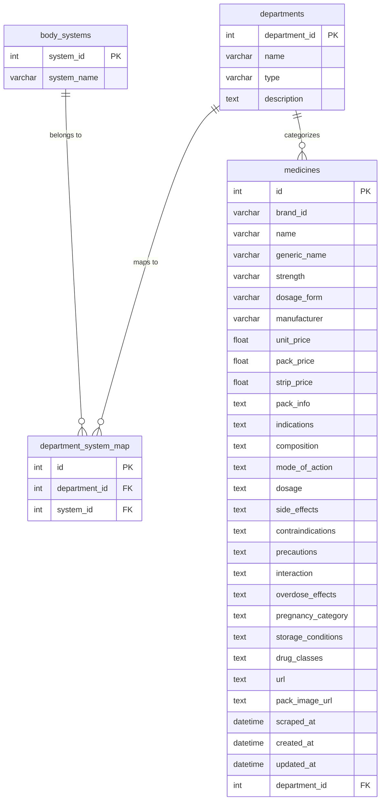

# Medical Departments Database Schema

Structured **medica    %% Relationships
    departments ||--o{ department_system_map : "maps to"
    body_systems ||--o{ department_system_map : "belongs to"
    departments ||--o{ medicines : "categorizes"
```

## **Tables**

### 1. `departments` in a **database schema** so that users can filter by **body system, specialization, surgical/medical type, patient group (adult/child), etc.**

## Mermaid ERD



## **Tables**al departments
Structured **medical departments** in a **database schema** so that, later user can filter by **body system, specialization, surgical/medical type, patient group (adult/child), etc.**

Here’s a normalized schema design idea:


## **Tables**

### 1. `departments`

| department\_id | name                          | type       | description                                          |
| -------------- | ----------------------------- | ---------- | ---------------------------------------------------- |
| 1              | Neurology                     | Medical    | Nervous system diseases (brain, spinal cord, nerves) |
| 2              | Neurosurgery                  | Surgical   | Surgical treatment of brain & spine                  |
| 3              | Psychiatry                    | Medical    | Mental health & behavior disorders                   |
| 4              | Cardiology                    | Medical    | Heart & blood vessels                                |
| 5              | Cardiothoracic Surgery        | Surgical   | Surgery on heart, lungs, chest                       |
| 6              | Pulmonology                   | Medical    | Lungs, asthma, COPD, TB                              |
| 7              | Orthopedics                   | Surgical   | Bones, joints, muscles                               |
| 8              | Gastroenterology              | Medical    | Digestive system & liver                             |
| 9              | Hepatology                    | Medical    | Liver-specific diseases                              |
| 10             | Urology                       | Surgical   | Urinary tract & male reproductive system             |
| 11             | Nephrology                    | Medical    | Kidney diseases                                      |
| 12             | Endocrinology                 | Medical    | Hormone & metabolism disorders                       |
| 13             | Gynecology                    | Medical    | Female reproductive health                           |
| 14             | Obstetrics                    | Medical    | Pregnancy & childbirth                               |
| 15             | Pediatrics                    | Medical    | Children’s health                                    |
| 16             | Neonatology                   | Medical    | Newborn care                                         |
| 17             | Ophthalmology                 | Surgical   | Eye care & surgery                                   |
| 18             | ENT (Otolaryngology)          | Surgical   | Ear, nose, throat                                    |
| 19             | Dermatology                   | Medical    | Skin, hair, nails                                    |
| 20             | Oncology                      | Medical    | Cancer treatment                                     |
| 21             | Radiology                     | Diagnostic | Imaging (X-ray, MRI, CT, USG)                        |
| 22             | Pathology                     | Diagnostic | Lab tests, biopsy                                    |
| 23             | Anesthesiology                | Medical    | Pain relief & surgery anesthesia                     |
| 24             | Emergency Medicine            | Medical    | Emergency & trauma care                              |
| 25             | Critical Care / ICU           | Medical    | Life support & critically ill patients               |
| 26             | Plastic & Reconstructive Surg | Surgical   | Cosmetic & repair surgery                            |
| 27             | Rheumatology                  | Medical    | Arthritis & autoimmune                               |
| 28             | Hematology                    | Medical    | Blood disorders                                      |
| 29             | Family Medicine               | Medical    | General primary care                                 |
| 30             | Palliative Care               | Medical    | End-of-life & pain care                              |

---

### 2. `body_systems`

| system\_id | system\_name         |
| ---------- | -------------------- |
| 1          | Nervous System       |
| 2          | Cardiovascular       |
| 3          | Respiratory          |
| 4          | Musculoskeletal      |
| 5          | Digestive            |
| 6          | Urinary              |
| 7          | Endocrine            |
| 8          | Reproductive         |
| 9          | Pediatrics           |
| 10         | Sensory Organs       |
| 11         | Skin & Integumentary |
| 12         | Oncology / Cancer    |
| 13         | Diagnostic           |
| 14         | General Medicine     |

---

### 3. `department_system_map`  (Many-to-Many relationship)

| id | department\_id       | system\_id          |
| -- | -------------------- | ------------------- |
| 1  | 1 (Neurology)        | 1 (Nervous System)  |
| 2  | 2 (Neurosurgery)     | 1 (Nervous System)  |
| 3  | 4 (Cardiology)       | 2 (Cardiovascular)  |
| 4  | 6 (Pulmonology)      | 3 (Respiratory)     |
| 5  | 7 (Orthopedics)      | 4 (Musculoskeletal) |
| 6  | 8 (Gastroenterology) | 5 (Digestive)       |
| 7  | 9 (Hepatology)       | 5 (Digestive)       |
| 8  | 10 (Urology)         | 6 (Urinary)         |
| 9  | 11 (Nephrology)      | 6 (Urinary)         |
| 10 | 12 (Endocrinology)   | 7 (Endocrine)       |
| 11 | 13 (Gynecology)      | 8 (Reproductive)    |
| 12 | 14 (Obstetrics)      | 8 (Reproductive)    |
| 13 | 15 (Pediatrics)      | 9 (Pediatrics)      |
| 14 | 16 (Neonatology)     | 9 (Pediatrics)      |
| 15 | 17 (Ophthalmology)   | 10 (Sensory Organs) |
| 16 | 18 (ENT)             | 10 (Sensory Organs) |
| 17 | 19 (Dermatology)     | 11 (Skin)           |
| 18 | 20 (Oncology)        | 12 (Cancer)         |
| 19 | 21 (Radiology)       | 13 (Diagnostic)     |
| 20 | 22 (Pathology)       | 13 (Diagnostic)     |
| 21 | 29 (Family Medicine) | 14 (General)        |

---

## Sample Query Examples

### Filter medicines by department type:
```sql
SELECT m.name, d.name as department, d.type 
FROM medicines m 
JOIN departments d ON m.department_id = d.department_id 
WHERE d.type = 'Surgical';
```

### Find medicines for specific body system:
```sql
SELECT DISTINCT m.name, m.generic_name
FROM medicines m 
JOIN departments d ON m.department_id = d.department_id
JOIN department_system_map dsm ON d.department_id = dsm.department_id
JOIN body_systems bs ON dsm.system_id = bs.system_id
WHERE bs.system_name = 'Cardiovascular';
```

### Department specialization overview:
```sql
SELECT bs.system_name, COUNT(d.department_id) as department_count
FROM body_systems bs
JOIN department_system_map dsm ON bs.system_id = dsm.system_id  
JOIN departments d ON dsm.department_id = d.department_id
GROUP BY bs.system_name
ORDER BY department_count DESC;
```

### Medicine statistics by department type:
```sql
SELECT 
    d.type as department_type,
    COUNT(m.id) as medicine_count,
    AVG(m.unit_price) as avg_price
FROM departments d
LEFT JOIN medicines m ON d.department_id = m.department_id
GROUP BY d.type
ORDER BY medicine_count DESC;
```
