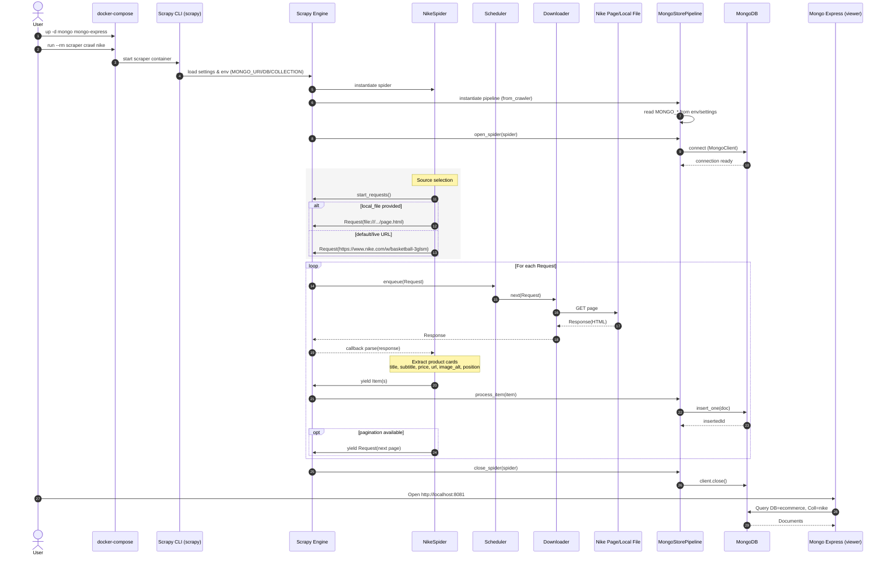

# Nike Spider process

```mermaid
sequenceDiagram
    autonumber
    actor U as User
    participant DC as docker-compose
    participant SC as Scrapy CLI (scrapy)
    participant SE as Scrapy Engine
    participant SP as NikeSpider
    participant SCH as Scheduler
    participant DL as Downloader
    participant NK as Nike Page/Local File
    participant PL as MongoStorePipeline
    participant MDB as MongoDB
    participant ME as Mongo Express (viewer)

    U->>DC: up -d mongo mongo-express
    U->>DC: run --rm scraper crawl nike
    DC->>SC: start scraper container
    SC->>SE: load settings & env (MONGO_URI/DB/COLLECTION)
    SE->>SP: instantiate spider
    SE->>PL: instantiate pipeline (from_crawler)
    PL->>PL: read MONGO_* from env/settings
    SE->>PL: open_spider(spider)
    PL->>MDB: connect (MongoClient)
    MDB-->>PL: connection ready

    rect rgb(245,245,245)
      note over SP: Source selection
      SP->>SE: start_requests()
      alt local_file provided
        SP->>SE: Request(file:///.../page.html)
      else default/live URL
        SP->>SE: Request(https://www.nike.com/w/basketball-3glsm)
      end
    end

    loop For each Request
      SE->>SCH: enqueue(Request)
      SCH->>DL: next(Request)
      DL->>NK: GET page
      NK-->>DL: Response(HTML)
      DL-->>SE: Response
      SE-->>SP: callback parse(response)

      note over SP: Extract product cards<br/>title, subtitle, price, url, image_alt, position
      SP->>SE: yield Item(s)

      SE->>PL: process_item(item)
      PL->>MDB: insert_one(doc)
      MDB-->>PL: insertedId

      opt pagination available
        SP->>SE: yield Request(next page)
      end
    end

    SE->>PL: close_spider(spider)
    PL->>MDB: client.close()

    U->>ME: Open http://localhost:8081
    ME->>MDB: Query DB=ecommerce, Coll=nike
    MDB-->>ME: Documents
```