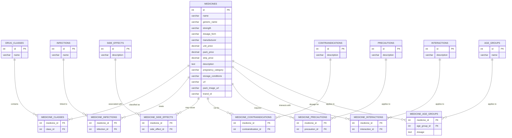

# ERD

```mermaid
erDiagram
    MEDICINES {
        int id PK
        varchar name
        varchar generic_name
        varchar strength
        varchar dosage_form
        varchar manufacturer
        decimal unit_price
        decimal pack_price
        decimal strip_price
        text description
        varchar pregnancy_category
        varchar storage_conditions
        varchar url
        varchar pack_image_url
        varchar brand_id
    }

    DRUG_CLASSES {
        int id PK
        varchar name
    }

    MEDICINE_CLASSES {
        int medicine_id FK
        int class_id FK
    }

    INFECTIONS {
        int id PK
        varchar name
    }

    MEDICINE_INFECTIONS {
        int medicine_id FK
        int infection_id FK
    }

    SIDE_EFFECTS {
        int id PK
        varchar description
    }

    MEDICINE_SIDE_EFFECTS {
        int medicine_id FK
        int side_effect_id FK
    }

    CONTRAINDICATIONS {
        int id PK
        varchar description
    }

    MEDICINE_CONTRAINDICATIONS {
        int medicine_id FK
        int contraindication_id FK
    }

    PRECAUTIONS {
        int id PK
        varchar description
    }

    MEDICINE_PRECAUTIONS {
        int medicine_id FK
        int precaution_id FK
    }

    INTERACTIONS {
        int id PK
        varchar description
    }

    MEDICINE_INTERACTIONS {
        int medicine_id FK
        int interaction_id FK
    }

    AGE_GROUPS {
        int id PK
        varchar name
    }

    MEDICINE_AGE_GROUPS {
        int medicine_id FK
        int age_group_id FK
        text dosage
    }

    MEDICINES ||--o{ MEDICINE_CLASSES : "classified as"
    DRUG_CLASSES ||--o{ MEDICINE_CLASSES : "contains"

    MEDICINES ||--o{ MEDICINE_INFECTIONS : "treats"
    INFECTIONS ||--o{ MEDICINE_INFECTIONS : "linked to"

    MEDICINES ||--o{ MEDICINE_SIDE_EFFECTS : "may cause"
    SIDE_EFFECTS ||--o{ MEDICINE_SIDE_EFFECTS : "associated with"

    MEDICINES ||--o{ MEDICINE_CONTRAINDICATIONS : "not for"
    CONTRAINDICATIONS ||--o{ MEDICINE_CONTRAINDICATIONS : "applies to"

    MEDICINES ||--o{ MEDICINE_PRECAUTIONS : "requires"
    PRECAUTIONS ||--o{ MEDICINE_PRECAUTIONS : "applies to"

    MEDICINES ||--o{ MEDICINE_INTERACTIONS : "interacts with"
    INTERACTIONS ||--o{ MEDICINE_INTERACTIONS : "applies to"

    MEDICINES ||--o{ MEDICINE_AGE_GROUPS : "dosage for"
    AGE_GROUPS ||--o{ MEDICINE_AGE_GROUPS : "applies to"
```